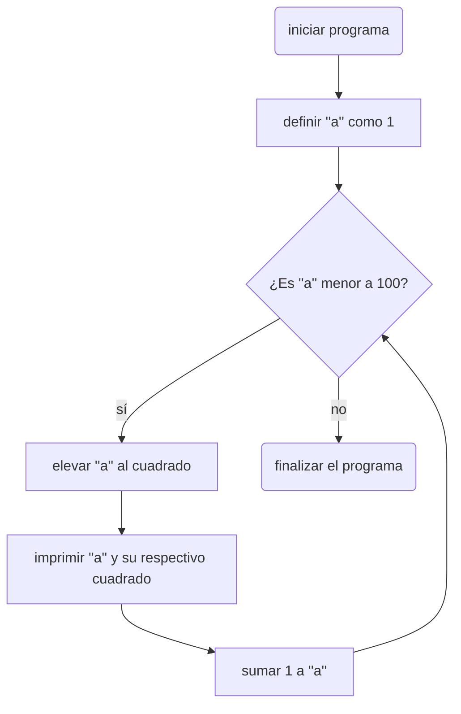
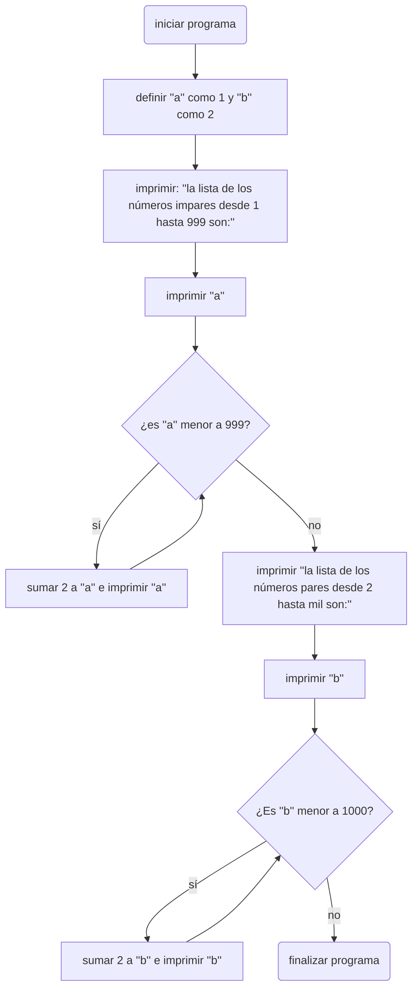

# Reto 7 PDC 2024-1
<div align='center'>
<figure> </br>
<figcaption><b></b></figcaption></figure>
</div>

## por: David Alejandro Montes Rodríguez
en este repositorio se presentan las soluciones a los ejercicos planteados para el reto 7:

---
## 1. imprimir un listado con los números del 1 al 100 cada uno con su respectico cuadrado
En este ejercicio se utiliza un bucle ```while``` para imprimir un número ````a```` y su respectivo cuadrado, el bucle empieza cuando ```a=1``` y acaba cuando ```a=100```, imprimiendo así en cada iteración el número ```a``` y su cuadrado.

```python
a:int=1
def cuadrados(a:int):
  while(a<=100):
    print("el número solicitado es:",a,"cuyo respectivo cuadrado es:",a**2)
    a= a+1

if __name__=="__main__":
  c=cuadrados(a)
```
## 2.imprimir un listado con los números impares desde 1 hasta 999 y seguidamente otro listado con los números pares desde 2 hasta 1000
En este ejercicio se utilizan dos variables ```a=1``` y ```b=2```. Primero se imprima ``a`` y mientras ```a``` sea menor que 999, se le irá sumando 2 a ``a``(por lo que se imprimiran: 1, 1+2=3, 3+2=5. Y asi sucesivamente), cuando a sea 999 se acabará el ciclo ``while`` y se realizará el mismo procedimeinto con ``b``.

```python
a:int= 1
b:int= 2
def pares_e_impares(a:int,b:int):
  print("los números impares desde 1 hasta 999 son:")
  print(a)
  while (a<999):
    print(a+2)
    a=a+2
  print("los números pares desde 2 hasta 1000 son:")
  print(b)
  while (b<1000):
    print(b+2)
    b=b+2

if __name__ == "__main__":
  pei=pares_e_impares(a,b)
```

## 3. imprimir los números pares en forma descendente hasta 2 que son menores o iguales a un número natural >= 2 dado.

Para este ejercicio se verifica si el número dado es par o no, de ser par,se imprime el propio número y en cada iteración se imprime el número restandole 2. Si el número es impar, se le resta 1, se imprime el nuevo número y se realiza la misma operación que en el anterior caso.

```python
def pares_mayores_2(a:int):
  if (a>=2):
    if a%2==0:
      print(a)
      while(a>2):
        print(a-2)
        a=a-2
    else:
      a=a-1
      print(a)
      while(a>2):
        print(a-2)
        a=a-2
  else:
    print("introduzca solo números naturales mayores o iguales a 2")

if __name__=="__main__":
  a= int(input("introduzca un número natural mayor o igual a 2:"))
  pm2=pares_mayores_2(a)
```

## 4. En 2022 el país A tendrá una población de 25 millones de habitantes y el país B de 18.9 millones. Las tasas de crecimiento anual de la población serán de 2% y 3% respectivamente. Desarrollar  un algoritmo para informar en que año la población el país B superara a la de A.

Para este ejercicio ya se tienen las variables necesarias dadas,(solo es necesario convertir las tasas de crecimiento a su forma decimal, lo cual dentro del código es posible asumir desde un principio.), solo es necesario realizar un proceso iterativo en el que cada año, a la población actual se sume la población nueva(la cual es el producto de la población actual por su tasa de crecimiento). Mientras la población de A sea menor o igual a la población de B, se realizará este procedimiento. Cuando acabe, se imprimirá el año de finalización del procdimiento( y de ñapa la población de cada país).

```python
a:int=25000000
b:int=18900000
tc_a:float=0.02
tc_b:float=0.03
año:int=2022
def predicción(a:int,b:int,tc_a:float,tc_b:float,año:int):
  while(b<a):
    a= a+a*tc_a
    b= b+b*tc_b
    año= año+1
  print("el año en el que la población de B superará a la de A será:",año)
  print("A contará con una población de:",a,"habitantes y B con una población de:",b,"habitantes")

if __name__ == "__main__":
  p=predicción(a,b,tc_a,tc_b,año)
```

## 5. Imprimir el factorial de un número n dado

En este ejercicio se utilizan dos variables ``n`` y ``m``, ``n`` será el número entregado por el usuario y ``m`` inicialmente será igual al ``n`` que ingresó el usuario originalmente. Mientras ``n>0`` se multiplicará a ``m`` por ``n-1`` y ``n-1`` se irá actualizando cada iteración. También se considera la excepción en la que ``n=0``, en donde se imprimirá el número 1, y el caso en el que el usuario introduzca un número negativo, al cual el programa respondera no poder calcular su factorial.

```python
def factorial_casero(n:int):
    m=n
    if n==0:
        return 1
    elif (n>0):
        while(n>1):
            n=n-1
            m=m*n
    return m

if __name__=="__main__":
  n=int(input("introduzca un numero n, para conocer su factorial n!:"))
  f=factorial_casero(n)
  if n>=0:
    print("el factorial del número",n,"es:",f)
  else:
     print("no es posible calcular el factorial de un número negativo")
      
```
## 6. Implementar un algoritmo que permita adivinar un número dado de 1 a 100, preguntando en cada caso si el número es mayor, menor o igual.
Si bien esto no es lo más eficiente y en código puede quedar un poquito raro, el programa inicia basandose en un hecho, y es que no se pueden usar números mayores a 100, por lo que lo más probable es que el número escogido sea menor que 100, si el usuario introduce que el número es menor que 100(al introducir que el número 100 es mayor que su número escogido), se le restará 10 a 100, se repetirá el proceso hasta que ``m=20`` en donde el programa preguntará si el número 1 es mayor, menor o igual a su número escogido, si el usuario introduce un ">" el programa igualmente asumirá que el número escogido. Tomando el caso del descenso hasta 1 como ejemplo: El programa entonces preguntará, y si el usuario ingresa que el número 1 es menor a su número escogido, el programa irá sumando 1 hasta que el usuario introduzca "=", donde se finalizará el programa ya que se adivinó el número escogido por el usuario.

```python
m:int=90
def adivinador(n:str,m:int):
  if n=="<":
    print("no se pueden usar números mayores a 100, por favor intente de nuevo")
  else:
    while n==">" and m>0:
      print("¿es el número",m,"mayor, menor o igual a su número escogido?")
      n=input(":")
      m=m-10
      if not n==">": break
      if m==10: m=m-9
    m=m+10
    if n=="<":
      m=m+1
      while n=="<":
        print("¿es el número",m," menor o igual a su número escogido?")
        n=input(":")
        m=m+1
        if m>100: break
        if n==">":
          print("tal vez se equivocó de signo, por favor intente de nuevo")
        if n=="=":break
      m=m-1
      print("su número escogido es el número",m)
    else:
        print("su número escogido es el número",m)

if __name__=="__main__":
  print("por favor solo introduzca respuestas de <, > o =")
  n=input("¿El número 100 es mayor o igual a su número escogido?: ")
  adivinador(n,m)
```
## 7. Implementar un programa que ingrese un número de 2 a 50 y muestre sus divisores.
El código lo comenté bastante así que creo que sería redundante explicarlo aquí, igual cabe aclarar que la idea principal para determinar que un número ``x`` sea divisor de un número ``n`` el residuo de la división ``x/n`` debe ser igual a 0.

```python
# apunte importante: todos los números naturales se pueden interpretar como la multiplicación de sus divisores primos
# en lo anterior se basa el minímo común múltiplo
#al aplicar el m.c.m a 50, se obtiene que sus divisores primos son:2 y 5, por ende, sus divisores son 2, 5, 25 y 10
#(aunque también el mismo 50 y el 1)
x:int=1
def divisores(n:int,x:int):
  if (n<=50 and n>=2):
    print("los divisores del número",n,"son:")
    while(x<=n):
      r:int= n/x#aquí se dividira a n por todos los números hasta n
      if (n%x==0): print(r)#aquí se imprimiran solo los divisores, ya que solo estos dan divisiones exactas
      x=x+1
  else:
    print("introduzca solo números entre 2 y 50")

if __name__ =="__main__":
  n=int(input("ingrese un número entre 2 y 50:"))
  divisores(n,x)
```
## 8. Implementar el algoritmo que muestre los números primos del 1 al 100. Nota: Use funciones
Aquí el código igualmente está bastante comentado, así que sería redundante volver a explicarlo acá, igualmente la idea principal es que un número es primo si no tiene divisores hasta su raíz cuadrada(por algo que se vio en el material recomendado por el profesor), el máximo número aquí es 100, y su raíz cuadrada 10, por lo que si un número no tiene divisores antes de 10, será primo, sin embargo, se está partiendo del hecho de que se conocen los números primos hasta 10.

```python
# vamos a hacerlo de una forma que saldrá, aunque puede ser un poquito trampa
# tras echar un repasito, es posible afirmar lo siguiente:
# si no se han encontrado divisores hasta la raíz cuadrada de un número:
#el número es primo
#aquí el máximo número es 100
#la raíz cuadrada de 100 es 10
#por ende, solo es necesario conocer si hay divisores de un número hasta 10
# y estos divisores solo pueden ser los números primos: 2,3,5 y 7
#(por esto ultimo digo que es medio trampa, y es que ya sabemos de antemano que 2, 3, 5 y 7 son primos)

def mult_2(n:int):
    if not(n%2==0) or n==2:
        return True
    else:
        return False
def mult_3(n:int):
    if not(n%3==0) or n<=3:
        return True
    else:
        return False
def mult_5(n:int):
    if not(n%5==0) or n<=5:
        return True
    else:
        return False
def mult_7(n:int):
    if not(n%7==0) or n<=7:
        return True
    else:
        return False

if __name__ == "__main__":
  n:int=2 # los números primos empiezan desde el 2 porque el 1 no es primo
  print("los números primos hasta el 100 son:")
  while (n<100):
    m2:bool=mult_2(n)
    m3:bool=mult_3(n)
    m5:bool=mult_5(n)
    m7:bool=mult_7(n)
    if m2==True and m3==True and m5==True and m7==True:
    #si el número no es multiplo ni de 2, ni de 3, ni de 5, ni de 7, será primo.
        print(n)
    n=n+1
```
# A continuación se presentan los diagramas correspondientes a los puntos 1,2 y 3

# diagrama punto 1:

# diagrama punto 2:


# diagrama del punto 3:
```mermaid
flowchart
A(Iniciar programa)-->B[solicitar un número natural n]
B-->C{¿Es n mayor o igual a 2?}
C-->|sí|D{¿Es n un número par?}
C-->|no|E[solicitar que por favor el usuario solo ingrese números naturales mayores o iguales a 2]
E-->Z(finalizar el programa)

D-->|sí|F{¿Es n mayor a 2?}
F-->|sí|G[imprimir n y restarle 2]-->F
D-->|no|H[restarle 1 a n]-->F
F-->|no|I[imprimir n]-->Z