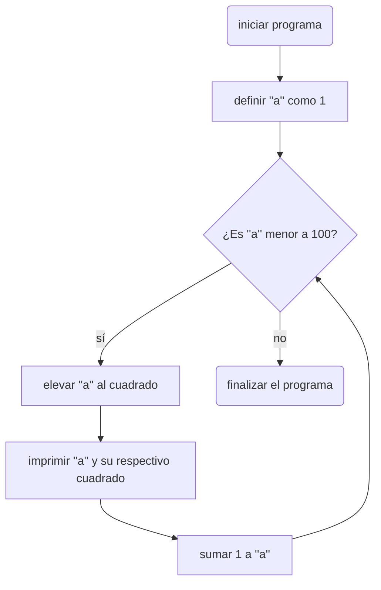
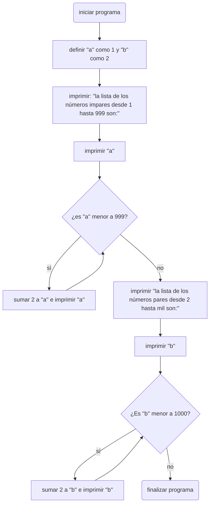

# diagrama punto 1:

# diagrama punto 2:


# diagrama del punto 3:
```mermaid
flowchart
A(Iniciar programa)-->B[solicitar un número natural n]
B-->C{¿Es n mayor o igual a 2?}
C-->|sí|D{¿Es n un número par?}
C-->|no|E[solicitar que por favor el usuario solo ingrese números naturales mayores o iguales a 2]
E-->Z(finalizar el programa)

D-->|sí|F{¿Es n mayor a 2?}
F-->|sí|G[imprimir n y restarle 2]-->F
D-->|no|H[restarle 1 a n]-->F
F-->|no|I[imprimir n]-->Z